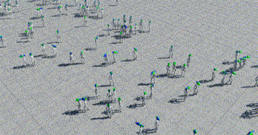
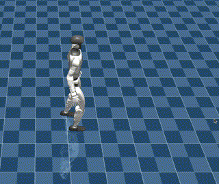

# G1 Deploy Mujoco


| IsaacLab | this project | Mujoco |
|:--------:|:--------:|:------:|
|  | <span style="font-size: 64px;">⟹</span>|  |


## ✨ 概览
This repository provides a lightweight deployment of `Unitree_RL_Lab` training results in Python with `Mujoco`, without requiring `IsaacSim`, `Unitree_RL_Lab`, or `IsaacLab` installations.  

It includes scripts to batch convert training checkpoints into `JIT / ONNX` models, enabling you to train on a server and easily visualize results locally in `Mujoco`.  

A sample G1 29-DoF walking policy (`checkpoint/policy.pt`) is provided for testing, and you can replace it with your own trained policies.

+ 本仓库无需依赖 `IsaaSim`, `Unitree_RL_Lab` 和 `IsaacLab` 的安装
+ 为 `Unitree_RL_Lab` 的训练结果，提供 `Mujoco` Python 版本的轻量化部署
+ 为 `Unitree_RL_Lab` 的训练结果，提供批量转换为 `JIT / ONNX` 模型的脚本
+ 应用场景是，在服务器上得到结果训练，拉到在本地，即可直接通过 `Mujoco` 查看训练结果
+ 提供了基础的 G1 29 自由度行走策略(`checkpoint/policy.pt`)供你尝试，你也可以将其替换为自己训练的策略


## 🛠️ 步骤（中文版）

1. 参考 [unitree_rl_lab](https://github.com/unitreerobotics/unitree_rl_lab) ，训练出 **29-DoF Unitree G1** 行走策略并导出`exported/policy.pt`

2. 克隆本仓库：
   ```bash
   git clone https://github.com/RoboCubPilot/g1_deploy_mujoco.git
    ```
3. 安装必要环境（如果已安装 Isaac Lab 环境可跳过）：
   ```bash
   conda env create -f environment.yml
   conda activate g1_deploy
    ```
4. 在 Mujoco 模拟器中运行 Sim2Sim，默认策略路径为  `checkpoint/policy.pt`：
   ```bash
   python deploy_mujoco.py --policy YOUR_POLICY_PATH
   ```
5. （可选）如需将 JIT 格式策略转换为 ONNX 格式：
   ```bash
   python scripts/convert_jit_to_onnx.py --jit-path YOUR_POLICY_PATH --onnx-path OUTPUT_ONNX_PATH
    ```
6. （可选）该脚本用于 **将 RSL-RL 的训练 checkpoint 批量转换为可部署的 JIT / ONNX 模型**，无需安装 IsaacSim 或 IsaacLab。  

   ```bash
   python scripts/batch_processing.py --input_path ORIGINAL_CHECKPOINT_PATH --output_path EXPORTED_PATH
   ```
   + `RIGINAL_CHECKPOINT_PATH`: 原始 checkpoint 的路径，可以是单个文件（如 `logs/2025-**/model_**.pt`）、目录（如 `logs/2025-**`），或通配符模式.
   + `EXPORTED_PATH`: 导出模型保存路径（默认：`./exported/`），也可以指定为任意自定义目录.   

## 🛠️ Steps (in English)

1. **Train a policy**  
   Train the **29-DoF Unitree G1** locomotion policy in [unitree_rl_lab](https://github.com/unitreerobotics/unitree_rl_lab) and export 
   `
   exported/policy.pt
   `

2. **Clone this repository**
   ```bash
   git clone https://github.com/RoboCubPilot/g1_deploy_mujoco.git
   ```

3. **Install environment** (skip if Isaac Lab is already installed)
   ```bash
   conda env create -f environment.yml
   conda activate g1_deploy
   ```

4. **Run deployment**  
   Launch Sim2Sim in Mujoco with the default policy path `checkpoint/policy.pt`:
   ```bash
   python deploy_mujoco.py --policy YOUR_POLICY_PATH
   ```

5. **(Optional) Convert JIT → ONNX**  
   ```bash
   python scripts/convert_jit_to_onnx.py --jit-path YOUR_POLICY_PATH --onnx-path EXPORTED_PATH
   ```

6. **(Optional) This script batch converts RSL-RL checkpoints into deployable JIT/ONNX models, without requiring Isaac Sim or Isaac Lab.**  

   ```bash
   python scripts/batch_processing.py --input_path ORIGINAL_CHECKPOINT_PATH --output_path EXPORTED_PATH
   ```
   + `RIGINAL_CHECKPOINT_PATH`: should point to the original checkpoint(s), e.g. a file (`logs/2025-**/model_**.pt`), directory(`logs/2025-**`), or wildcard pattern.
   + `EXPORTED_PATH`: specifies where the exported models will be saved (default: `./exported/`). You can override it to any custom folder.

---

## 🎉 Features

- 🏃‍♂️ Deploy RL policies to Mujoco in seconds  
- 🔄 JIT → ONNX conversion supported  
- 🔌 Seamless integration with Unitree RL Lab  

---